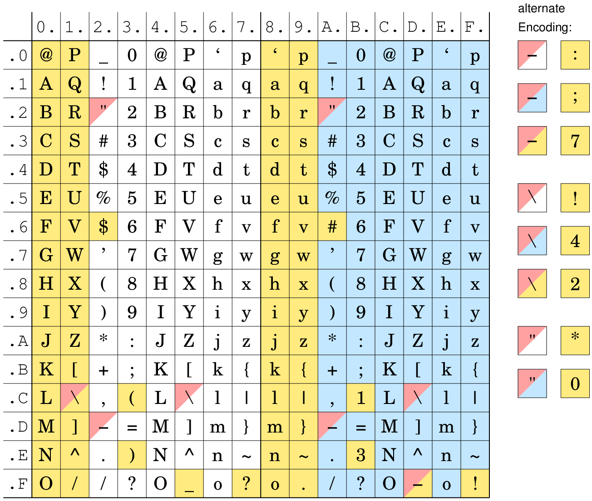
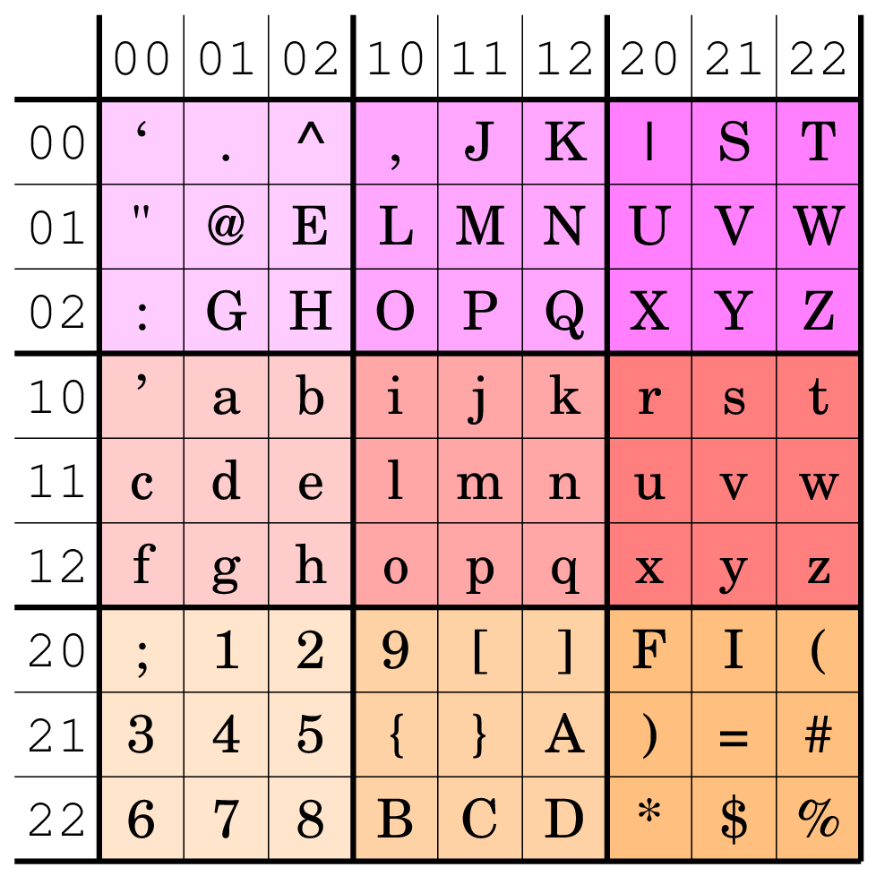

# Siso93 – A human-readable binary-to-text encoding

As with Base85 we encode 4 octets into 5 characters, so the "encoding overhead" is 25% + overhead due to line breaks.
The encoded data has this format:
```
    ,-----+------+------+------+------.
    | tag | enc0 | enc1 | enc2 | enc3 |
    `-----+------+------+------+------'
```
Every input data octet is represented by one output character. The 256 possible values are divided into 3 "planes" with 85…86 characters per plane. The "tag" character encodes the planes for the four following bytes. So there are 3x3x3x3 = 81 different tags possible.

We chose the encoding alphabet so ASCII text is as human-readable as possible: Nearly all printable ASCII bytes are encoded 1:1, except "not HTML-safe" characters `&`, `<` and `>`. The encoding alphabet for the "tag" character is chosen that ASCII-dominating input text will have "light" tag characters that disturbs the human reader as little as possible.

The encoding of the data octets shows this table:



White boxes denotes characters in "plane 0", yellow in "plane 1" and blue in "plane 2".
For some characters there are alternative encodings defined if their occurrence in the encoded text is unwanted. More alternative encodings can be defined in the future (the yellow plane 1 has a lot of spare space, yet).

The encoding of the "tag" byte shows this table:



The first two data octets determine the table row, the last two data octets determine the table column.

Example: If the 4 octets are in the planes 0, 2, 2, 1, the tag byte is encoded as `Y`.
